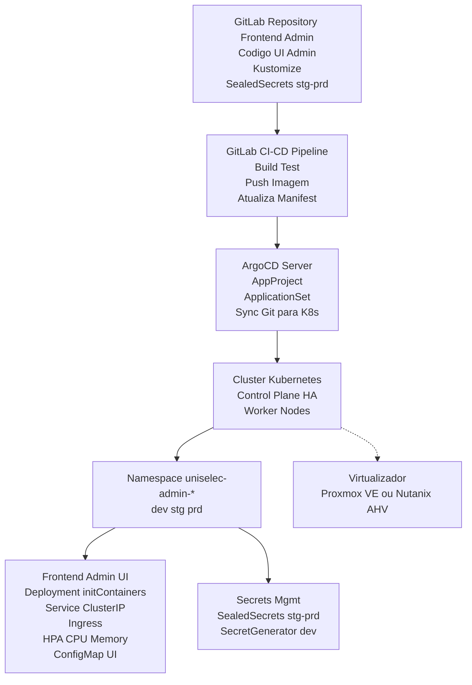

Executar as migrations:

    docker exec -it uniselec-api bash -c "php artisan migrate"


### Arquitetura da solução


## Segredos (Sealed Secrets)
```sh
kubectl apply -f https://github.com/bitnami-labs/sealed-secrets/releases/download/v0.33.1/controller.yaml
kubeseal -f regcred-secret.yaml -w base/sealed-secret-regcred.yaml --scope cluster-wide
kubeseal --validate < base/sealed-secret-regcred.yaml
```
### Desprovisionar Deploy
```sh
argocd login argocd.unilab.edu.br --username admin --password "pass" --grpc-web
argocd app list
kubectl -n argocd patch applicationset uniselec-admin-dev-as --type='merge' -p '{"spec":{"generators":[{"list":{"elements":[]}}]}}'
argocd app list | grep uniselec-admin-dev
```

### Re-Provisionar Deproy
```text
┌───────────────────────────────────────────────────────────────────────────┐
│                       Inital Pipeline Execution Flow                      │
└───────────────────────────────────────────────────────────────────────────┘
┌──────────────┐  ┌───────────┐  ┌──────────┐  ┌──────────┐  ┌──────────────┐
│   validate   │─>│   tests   │─>│  build   │─>│ staging  │─>│ notification │
└──────────────┘  └───────────┘  └──────────┘  └──────────┘  └──────────────┘
│                 │              │             │             │
├─ docker         ├─ dependency  └─ docker     └─ deploy     └─ staging
├─ environment    ├─ sast_scan                 (re-run aqui)
└─ kustomize      ├─ sonarqube
                  └─ unit
```
**Ação necessária**: Rodar o Job `staging` da Pipeline GitLab CI/CD GitOps

